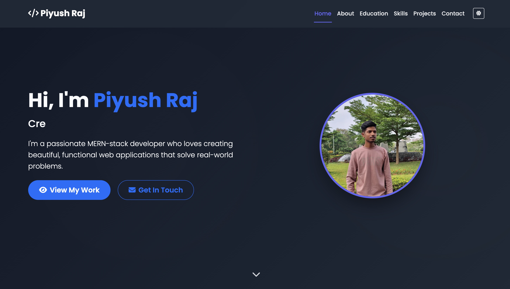

# 🌐 My Portfolio Website

This is my personal portfolio website built using **HTML, CSS, JavaScript, and AOS (Animate On Scroll)**.  
It showcases my **skills, projects, education, and contact details** in a clean and responsive design.

---

## ✨ Features
- Responsive design (works on mobile, tablet, desktop)
- About Me section
- Skills section with progress bars
- Projects showcase with links
- Contact form / social media links
- Smooth animations using **AOS (Animate On Scroll)** library
- Modern and minimal UI

---

## 🛠️ Tech Stack
- **Frontend:** HTML, CSS, JavaScript  
- **CSS Framework:** (Bootstrap / custom CSS)  
- **Animations:** AOS (Animate On Scroll)  
- **Icons:** FontAwesome  
- **Hosting:** GitHub Pages / Netlify   

---

## 📸 Preview


---

## 🚀 Deployment
My portfolio is live at:  
👉 [Click here to view](https://piyushportfolio12.netlify.app)

---

## ⚙️ Run Locally
If you want to run this project on your local machine, follow this step:

```bash
git clone https://github.com/PiyushKumarraj/Portfolio-Website.git
